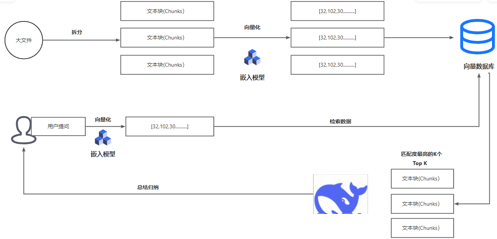

> 背景：很多人想象得AI知识库，就是把所有资料一股脑拖进AI客户端，比如cherryStudio里面，然后AI就能把里面的内容全部认真读一遍，综合分析思考，最后生成一个完美的结论。然后实际体验了以后，很多人发现AI知识库效果并没有想象那么好，总是遇到各种奇怪问题。
>

# 📚 AI 知识库：技术原理、三大痛点与进阶方案

------

## ⚙️ 技术原理：AI 知识库如何工作？

AI 知识库的核心是 **RAG（检索增强生成）** 技术，工作流程主要包括：

1. 📥 **数据接入**：导入文档、网页、数据库等多源数据。
2. ✂️ **分块处理**：将长文本切割成语义片段（Chunk），便于检索。
3. 🔢 **向量化表示**：通过嵌入模型（Embedding）将文本转为向量。
4. 🗄 **向量数据库**：存储文本向量，支持高效相似度检索。
5. 🤖 **生成回答**：检索上下文 → 拼接 Prompt → 输入大模型 → 生成最终回答。

👉 简单理解：**知识库是大模型的“外挂记忆”，让 AI 能随时查询最新数据并生成更准确的答案。**

------

## 🚨 三大痛点：AI 知识库的挑战

尽管 RAG 架构成熟，但在实际落地中常遇到以下难题：

1. 🎯 **召回相关性不足**
   - 向量检索结果相关度不够，容易出现无关或低质内容。
2. 🧩 **上下文拼接混乱**
   - 检索到的片段过长/过短，影响 LLM 理解与回答质量。
3. ⚖️ **可信度与可控性缺失**
   - 回答无法稳定引用来源，难以保证可追溯性。

------

## 🚀 进阶方案：如何优化 AI 知识库？

为突破以上痛点，可以采用以下优化路径：

### 1️⃣ 🔄 重排序模型（Re-rank）

- **问题**：纯向量相似度计算容易引入噪音，无法完全体现语义相关性。
- **方案**：
  - 在初步向量检索后，引入 **Re-rank 模型**（常基于 BERT / Cross-Encoder）。
  - 该模型输入 **问题 + 候选文本**，输出相关性分数。
  - 通过语义级别的精确匹配，将结果重新排序，把真正相关的文本排在最前。
- **效果**：大幅提升召回结果的相关性与回答精度。

------

### 2️⃣ 🗄 数据库 MCP Server（多模态内容处理）

- **问题**：RAG 缺乏“大局观”，无法对复杂文件（如 Excel、PDF 表格）做整体总结。
- **方案**：
  - 引入 **MCP Server**（Multi-Content Processing Server）。
  - 针对 **结构化数据**（Excel/SQL）、**非结构化数据**（长 PDF、报告） 提供专门的解析和聚合能力。
  - 在检索前对复杂文件进行 **预摘要 / 聚合索引**，让 LLM 直接调用总结后的内容。
- **效果**：解决了传统 RAG “只看片段”的局限，实现跨表、跨文件的总结性回答。

------

### 3️⃣ 📏 动态切分与语义 Chunking

- **问题**：粗暴的固定长度切片要么过长（冗余），要么过短（丢失上下文）。
- **方案**：
  - 使用 **动态 Chunking**：根据段落、语义边界切分。
  - 引入 **滑动窗口算法**，保证相邻切片之间的上下文连续性。
- **效果**：检索结果更贴近自然语义，减少“答非所问”。

------

### 4️⃣ 🧠 超长上下文模型

- **问题**：当问题需要跨越大量文档时，普通 LLM 的上下文窗口有限（几千 token）。
- **方案**：
  - 采用 **超长上下文模型**（如 Claude 3.5、Gemini 2.0、GPT-4 Turbo），支持几十万甚至百万 token 输入。
  - 在特定场景下直接将大篇幅上下文“暴力”送入模型。
- **效果**：减少切片和检索的复杂性，提升大局性理解能力。

------

### 5️⃣ ⚡ Hybrid Search（混合检索）

- **问题**：仅依赖向量检索可能丢失关键词精确匹配。
- **方案**：
  - 结合 **关键词检索（BM25）+ 向量检索**。
  - Hybrid 策略既能保证语义相似度，又能确保关键字不遗漏。
- **效果**：更全面的召回，提高召回率和精度平衡。

------

### 6️⃣ 📑 可信度与可控性增强

- **问题**：AI 回答缺乏出处和可追溯性，容易失信。
- **方案**：
  - 回答中强制绑定 **来源文档 / 段落 ID / URL**。
  - 在 UI 层面展示“参考来源”，支持点击跳转验证。
  - 加入 **可解释性机制**，输出不仅是结论，还包括推理链。
- **效果**：增强企业级应用的可靠性，便于审计和追责。

✨ 总结：
 通过 **Re-rank → MCP Server → 动态 Chunking → 超长上下文模型 → Hybrid Search → 可信度增强** 的组合优化，可以让 AI 知识库从一个“关键词答题器”，进化为真正的 **智能助手**，既懂语义、又有全局观，还能给出可靠来源。
