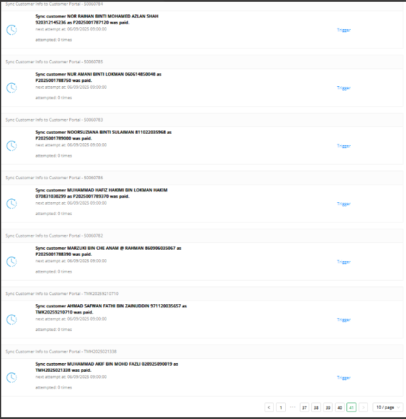
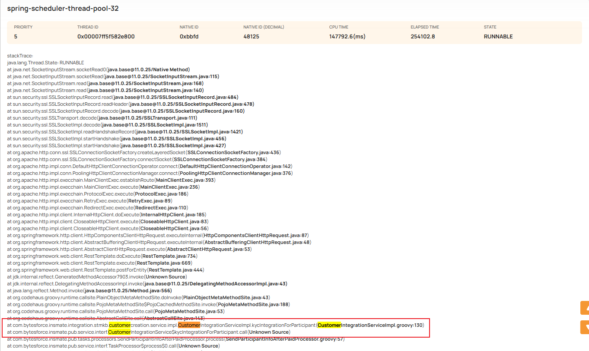
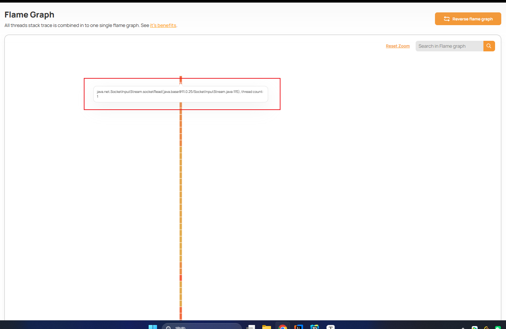
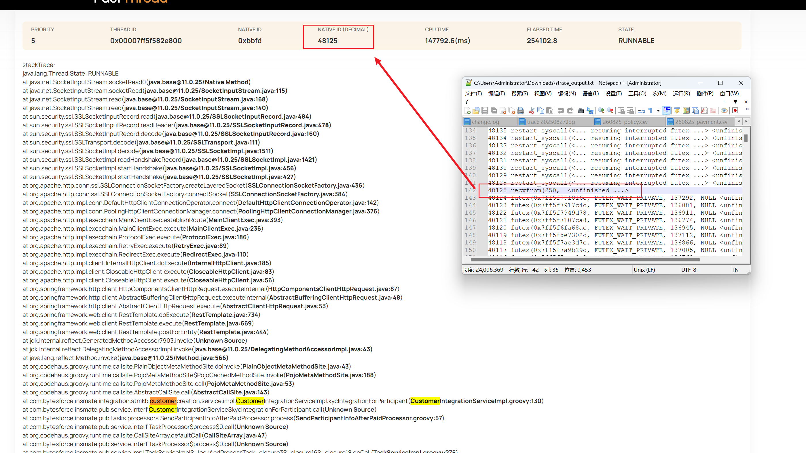

# [问题排查]一次 SSL 握手导致业务线程阻塞与 Task 堆积的排查记录

## ⚠️问题描述

客户反馈：系统中的 **task 未被执行**，全部停留在 **pending 状态**，并持续堆积。

📸 监控截图：

## 🔍 分析过程

### 1️⃣ KYC 接口失败重试

由于9.4 / 9.5 客户 KYC接口一直失败，怀疑是KYC接口失败重试导致task数量超出了最大限制

```groovy
@TenantScheduled(fixedDelay = MySchedule.TU_5_SECONDS, initialDelay = MySchedule.TU_1_MINUTE)
    void scheduleHighTask() {
        if (!EnvUtils.isSystemUpAndRunning) {
            return
        }
        processTask(GlobalConst.TASK_PRIORITY_HIGH)
    }    

void processTask(String priority) {
        if (!EnvUtils.isSystemUpAndRunning) {
            return
        }
        if (EnvUtils.unittest()) {
            return
        }
        UserContextUtils.run {
            List<String> taskTypes = TaskUtils.getAllTaskTypeByPriority(priority)
            List<String> taskIds = taskService.getPendingTaskIdsByTaskTypes(taskTypes)
            if (taskIds == null || taskIds.size() == 0) {
                log.debug("no tasks to be processed with priority [${priority}]")
                return
            }
            taskIds.each { taskId ->
                taskService.lockAndProcessTask(taskId)
            }
        }.withBatchAdminLoggedIn().on(this).go()
    }
```

*TenantScheduled注解和spring的Scheduled作用差不多

getPendingTaskIdsByTaskTypes 是查询系统内部有多少待执行的task，具体sql大概如下

```mysql
SELECT
        task_id,task_type,generated_at,started_at,finished_at,due_at,`status`,retry_times,created_at,last_updated_at
FROM
        task 
WHERE
        task_type IN ("AUTO_SUBMIT_PROPOSAL","AUTO_Update_Policy_Status_To_Declined","CREATE_CROSS_SELL_URL_AND_SEND_EMAIL","CREATE_EMEDICAL_CARD",
                                                        "SEND_EMANDATE","AUTO_TESTING_EXCEL","AUTO_TESTING_ZIP","AUTO_UW_TO_DECLINE_POLICY","CBC_TRANS_ISSUE","CREATE_PROPOSALDETAILS_REPORT",
                                                        "CREATE_SIMPLIFIED_PROPOSALDETAILS_REPORT","POLICY_FILE_INTEGRATION","POLICY_FILE_INTEGRATION_PUSH_FTP","SEND_CUSTOMER_INFO","KYC_INTEGRATION_PARTICIPANT",
                                                        "SMS","SUST_CHECK") 
        AND STATUS IN ("PENDING","FAIL","TO_CONTINUE") 
        AND due_at <= NOW() 
        AND retry_times < 18
ORDER BY
        STATUS DESC,
        retry_times,
        due_at 
```

初步workaround-> 让客户修复KYC接口，任务应该就会自动执行。

❌ **结果**: 客户重启了KYC 服务，但是task数据依旧不变，仍然堆积。

### 2️⃣ 怀疑线程池被阻塞

推测：**KYC 接口调用阻塞，导致定时任务线程池卡死**。

- 在 UI 触发 KYC task → 可以正常调用
- 后端 RestTemplate 已设置超时

```groovy
responseEntity = ProjectUtils.getRestTemplate(true,60).postForEntity(url, requestEntity, Object)

            if (timeout > 0){
                                    // 设置超时时间
                                    RequestConfig requestConfig = RequestConfig.custom()
                                            .setConnectTimeout(timeout * 1000 )  // 连接超时 180秒
                                            .setSocketTimeout(timeout * 1000)   // 读取超时 180秒
                                            .build()
                                    httpClient = HttpClients.custom()
                                            .setSSLSocketFactory(new SSLConnectionSocketFactory(sslContext, NoopHostnameVerifier.INSTANCE))
                                            .setDefaultRequestConfig(requestConfig)
                                            .setConnectionReuseStrategy(NoConnectionReuseStrategy.INSTANCE)
                                            .build()
                                }
```

结论：👉 说明问题不在超时配置。

### 3️⃣ 打印线程栈 → 发现真实原因

在生产服务器执行打印堆栈命令

```shell
1. ps -ef | grep java

2. jcmd <pid> Thread.print > /tmp/thread_dump_$(date +%Y%m%d_%H%M%S).txt
```

 在线分析工具: [FastThread]( https://fastthread.io/)

分析定时任务线程池：发现四台服务器的定时任务线程池有一个任务Task一直卡在调用KYC 服务上。

```groovy
stackTrace:
java.lang.Thread.State: RUNNABLE
at java.net.SocketInputStream.socketRead0(java.base@11.0.25/Native Method)
at java.net.SocketInputStream.socketRead(java.base@11.0.25/SocketInputStream.java:115)
at java.net.SocketInputStream.read(java.base@11.0.25/SocketInputStream.java:168)
at java.net.SocketInputStream.read(java.base@11.0.25/SocketInputStream.java:140)
at sun.security.ssl.SSLSocketInputRecord.read(java.base@11.0.25/SSLSocketInputRecord.java:484)
at sun.security.ssl.SSLSocketInputRecord.readHeader(java.base@11.0.25/SSLSocketInputRecord.java:478)
at sun.security.ssl.SSLSocketInputRecord.decode(java.base@11.0.25/SSLSocketInputRecord.java:160)
at sun.security.ssl.SSLTransport.decode(java.base@11.0.25/SSLTransport.java:111)
at sun.security.ssl.SSLSocketImpl.decode(java.base@11.0.25/SSLSocketImpl.java:1511)
at sun.security.ssl.SSLSocketImpl.readHandshakeRecord(java.base@11.0.25/SSLSocketImpl.java:1421)
at sun.security.ssl.SSLSocketImpl.startHandshake(java.base@11.0.25/SSLSocketImpl.java:456)
at sun.security.ssl.SSLSocketImpl.startHandshake(java.base@11.0.25/SSLSocketImpl.java:427)
at org.apache.http.conn.ssl.SSLConnectionSocketFactory.createLayeredSocket(SSLConnectionSocketFactory.java:436)
at org.apache.http.conn.ssl.SSLConnectionSocketFactory.connectSocket(SSLConnectionSocketFactory.java:384)
at org.apache.http.impl.conn.DefaultHttpClientConnectionOperator.connect(DefaultHttpClientConnectionOperator.java:142)
at org.apache.http.impl.conn.PoolingHttpClientConnectionManager.connect(PoolingHttpClientConnectionManager.java:376)
at org.apache.http.impl.execchain.MainClientExec.establishRoute(MainClientExec.java:393)
at org.apache.http.impl.execchain.MainClientExec.execute(MainClientExec.java:236)
at org.apache.http.impl.execchain.ProtocolExec.execute(ProtocolExec.java:186)
at org.apache.http.impl.execchain.RetryExec.execute(RetryExec.java:89)
at org.apache.http.impl.execchain.RedirectExec.execute(RedirectExec.java:110)
at org.apache.http.impl.client.InternalHttpClient.doExecute(InternalHttpClient.java:185)
at org.apache.http.impl.client.CloseableHttpClient.execute(CloseableHttpClient.java:83)
at org.apache.http.impl.client.CloseableHttpClient.execute(CloseableHttpClient.java:56)
at org.springframework.http.client.HttpComponentsClientHttpRequest.executeInternal(HttpComponentsClientHttpRequest.java:87)
at org.springframework.http.client.AbstractBufferingClientHttpRequest.executeInternal(AbstractBufferingClientHttpRequest.java:48)
at org.springframework.http.client.AbstractClientHttpRequest.execute(AbstractClientHttpRequest.java:53)
at org.springframework.web.client.RestTemplate.doExecute(RestTemplate.java:734)
at org.springframework.web.client.RestTemplate.execute(RestTemplate.java:669)
at org.springframework.web.client.RestTemplate.postForEntity(RestTemplate.java:444)
at jdk.internal.reflect.GeneratedMethodAccessor7903.invoke(Unknown Source)
at jdk.internal.reflect.DelegatingMethodAccessorImpl.invoke(java.base@11.0.25/DelegatingMethodAccessorImpl.java:43)
at java.lang.reflect.Method.invoke(java.base@11.0.25/Method.java:566)
at org.codehaus.groovy.runtime.callsite.PlainObjectMetaMethodSite.doInvoke(PlainObjectMetaMethodSite.java:43)
at org.codehaus.groovy.runtime.callsite.PojoMetaMethodSite$PojoCachedMethodSite.invoke(PojoMetaMethodSite.java:188)
at org.codehaus.groovy.runtime.callsite.PojoMetaMethodSite.call(PojoMetaMethodSite.java:53)
at org.codehaus.groovy.runtime.callsite.AbstractCallSite.call(AbstractCallSite.java:143)
at com.bytesforce.insmate.integration.stmkb.customercreation.service.impl.CustomerIntegrationServiceImpl.kycIntegrationForParticipant(CustomerIntegrationServiceImpl.groovy:130)
at com.bytesforce.insmate.pub.service.interf.CustomerIntegrationService$kycIntegrationForParticipant.call(Unknown Source)
at com.bytesforce.insmate.pub.tasks.processors.SendParticipantInfoAfterPaidProcessor.process(SendParticipantInfoAfterPaidProcessor.groovy:57)
```

📌 结果：

- 定时任务线程池有线程 **卡在 KYC 服务调用**。
- 线程状态：`RUNNABLE`，停在 **SSL 握手阶段**。

通过火焰图分析可以看到KYC一直卡在SSL握手阶段



Pid对应的线程 也是一直处于recvform状态



📌 进一步确认：

- **ClientHello 已发送**
- 线程阻塞在 **等待服务端响应**
- `socketTimeout` 没有生效
- Pid 对应线程一直处于 **recvfrom 状态**

### 📝 分析结论

**根因**：SSL 握手阶段服务端无响应，导致业务线程长期阻塞。

**结果**：定时任务线程池被占满，task 无法继续执行。

**复现**：本地无法稳定复现，怀疑服务端安全策略导致。

## 📚 经验总结

1. 🛠 **学会打印并分析线程栈**，快速定位阻塞点。
2. ⏱ **对接第三方接口时，必须设置 TCP/SSL 超时**，避免线程被无限阻塞。
3. 🔐 **服务端未响应原因**：可能因客户端频繁 SSL 握手触发安全策略（待进一步确认）。
