Day2

大多数时间都在用手机选股，但是不知道有哪些股，甚至涨停都不知道。所以今天学习同花顺如何自选股，如果分析股票。

## 📚如何自选分组

首先我们需要了解股票如何自选

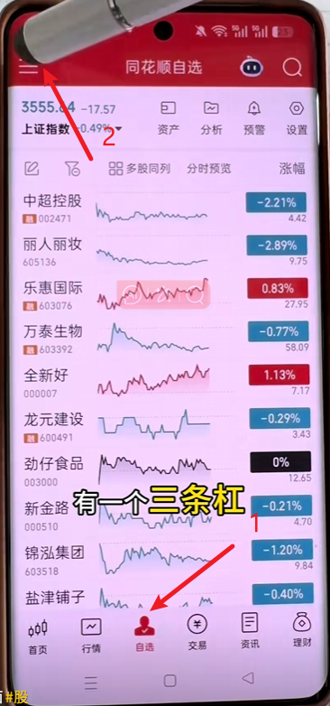

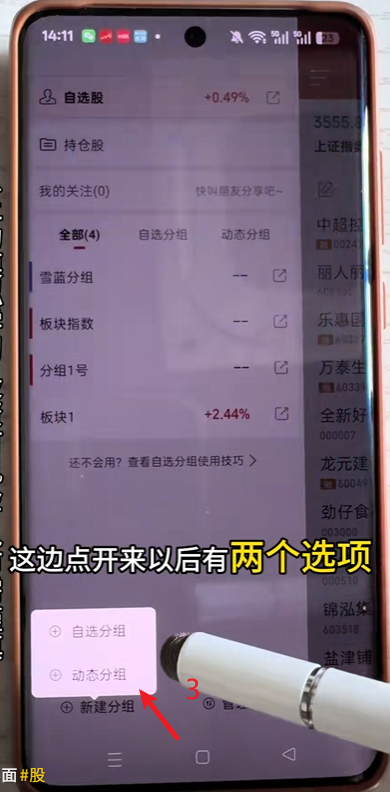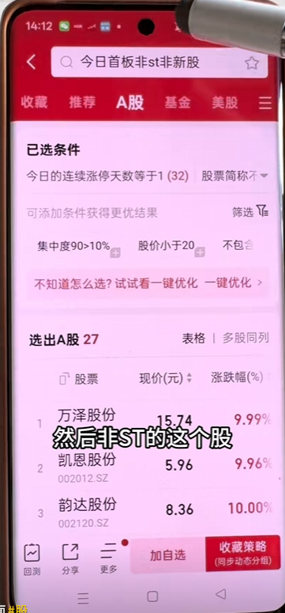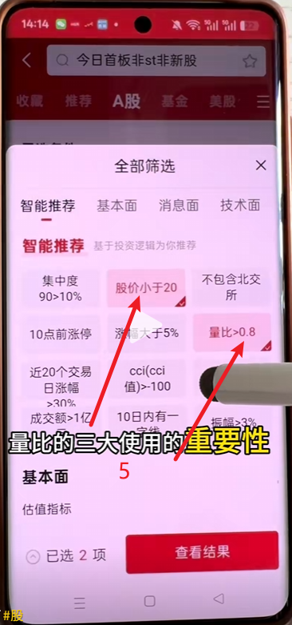

在软件里找到**动态分组**，然后搜索**‘今日首板非ST’ '非新股'**，**筛选**股价小于二十元和量比大于0.8（也可以选择其他）

## 如何设置表头

编辑表头新加 **竞价金额 + 成交额**

为什么要把竞价金额放前面？因为它表明的意思是主力用真金白银在投票，他是主力的进场信号。

1. 500万以上：大游资/机构在试盘（重点观察）
2. 1000万以上：主力明确表态“今天我要干这只”（连扳概率上升）
3. <200万：纯散户跟风（90%会高开低走）

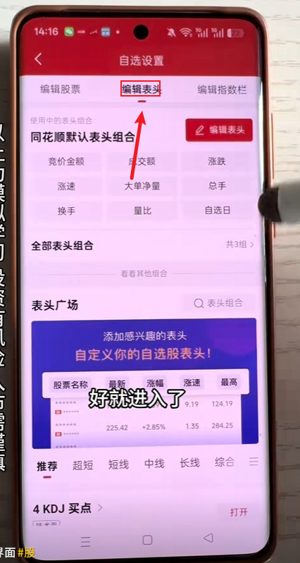

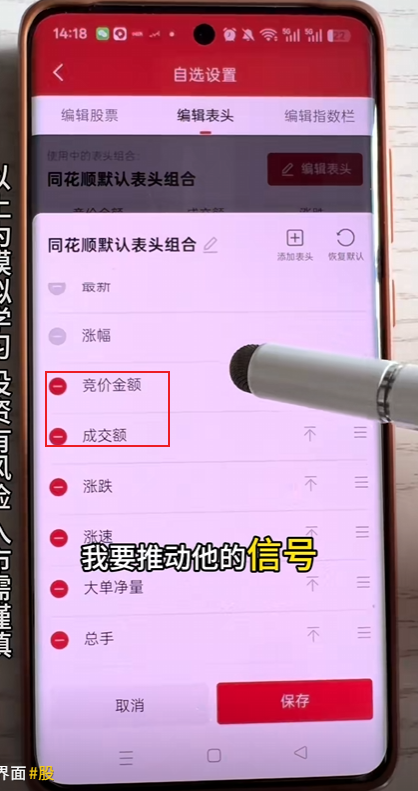

可以查看多股同列，分时查看K图

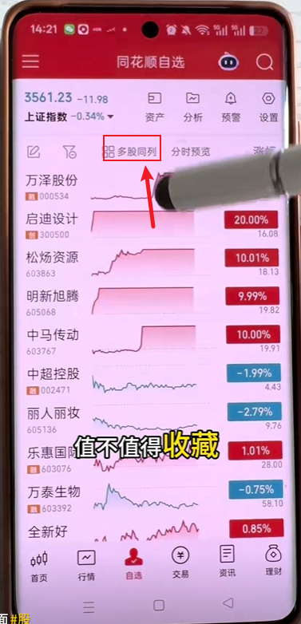

## 查看资金

可以查看板块资金和购股资金 

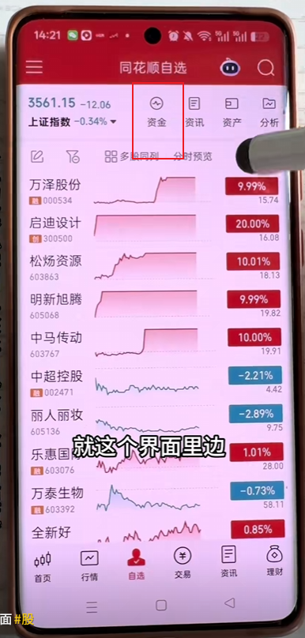

可以通过**自选资金和个股资金**可以更好了解主力资金更看好的版块

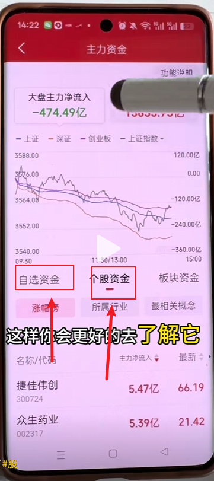

可以查看**咨询和分析**，更好地分析股票

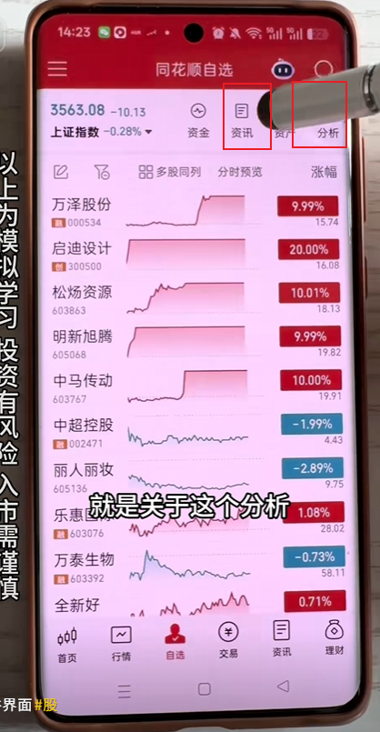

## 🔥强烈推荐-如何设置预警

短线高手实用功能

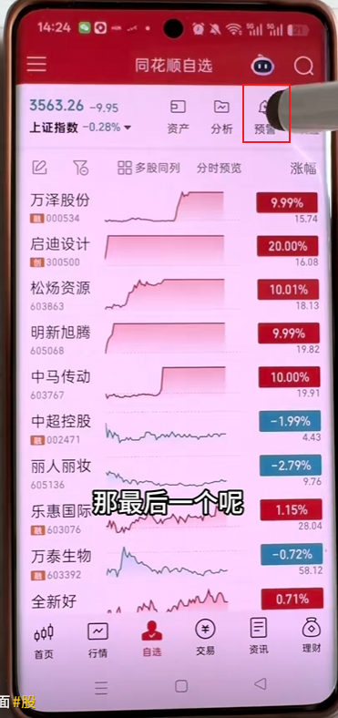

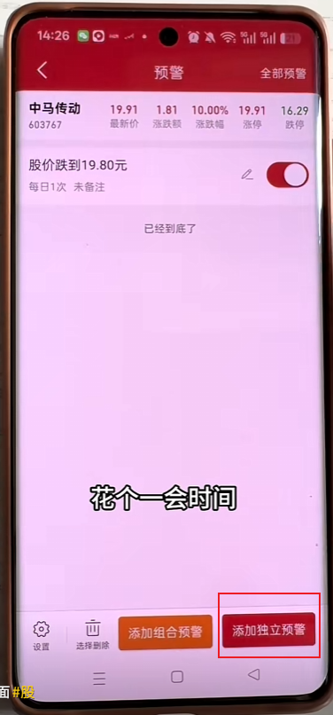